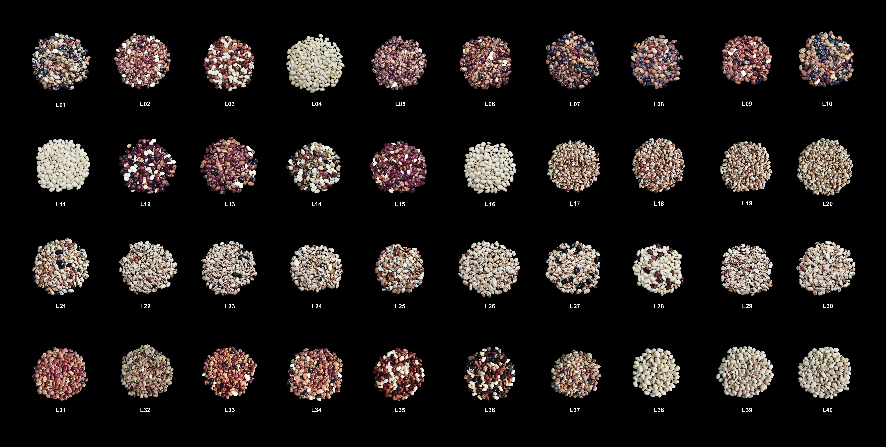

# Leveraging G×E Interaction to Optimize Multi-Trait Selection in Lima Bean

Reproducible analysis pipeline for evaluating **genotype-by-environment interaction (G×E)** and optimizing **multi-trait selection** in **lima bean (*Phaseolus lunatus* L.)** using **GGE biplot**, **GT biplot**, and a **desired-gain index**.

---

## Authors

**Gérson N. C. Ferreira¹†**, **João P. S. Pavan¹†**, **Mauricio S. Araújo¹**, **Dayana R. Sousa¹**, **Michelle S. Nascimento²**, **Vanessa G. Moura²**, **José T. Chagas¹**, **Yasmin I. Retore¹**, **Josieli L. Silva²**, **Maria S. S. Silva²**, **Regina L. F. Gomes²**, **Ângela C. A. Lopes²**, **Maria I. Zucchi³˒⁴**, **José B. Pinheiro¹\***

† These authors contributed equally to this work.  
\* Corresponding author: **pinheirojb@usp.br**

### Affiliations

1. Genetics Diversity and Breeding Laboratory, Department of Genetics, “Luiz de Queiroz” College of Agriculture (ESALQ/USP), Piracicaba, São Paulo, Brazil  
2. Department of Plant Science, Federal University of Piauí (UFPI), Teresina, Piauí, Brazil  
3. Conservation Genetics and Genomics Group, Department of Genetics, ESALQ/USP, Piracicaba, São Paulo, Brazil  
4. Secretariat of Agriculture and Food Supply of São Paulo State, Piracicaba, São Paulo, Brazil  

---

## Abstract

Lima bean stands out for its wide adaptation to diverse edaphoclimatic conditions and is a promising crop for low-input farming systems. However, trait expression is strongly influenced by genotype-by-environment interaction (G×E), complicating the selection of broadly adapted and stable genotypes.

This study evaluated G×E interaction in **40 lima bean breeding lines** across **three Brazilian agro-ecological environments**. Trials were conducted in a **randomized complete block design** with **three replications**. The significance of effects was tested using **likelihood-ratio tests**, and G×E was investigated with the **GGE biplot**. Simultaneous multi-trait selection was performed using the **Genotype-by-Trait (GT) biplot** and a **desired-gain index**.

### Key findings

- Significant **G×E interaction** was detected for **all traits**, indicating differential genotype responses across environments.  
- Lines **L06, L27, L14, L21, and L34** were selected as ideotypes combining **high yield**, **stability**, and **overall multi-trait performance**, supporting cultivation under contrasting edaphoclimatic conditions.

**Keywords:** *Phaseolus lunatus* L.; genotype-by-environment interaction; GGE biplot; multi-trait selection; stability.

---

## Results (plots)

---

## Repository layout

- `Codes/` – analysis scripts (model fitting, biplots, selection indices)  
- `Data/` – raw/processed datasets used in the study  
- `Plots/` – figures exported from the pipeline (final and intermediate)

---

## Citation

If you use this code, data, or results in your research, please cite:

> Ferreira, G. N. C., Pavan, J. P. S., Araújo, M. S., Sousa, D. R., Nascimento, M. S., Moura, V. G., Chagas, J. T., Retore, Y. I., Silva, J. L., Silva, M. S. S., Gomes, R. L. F., Lopes, Â. C. A., Zucchi, M. I., & Pinheiro, J. B. **Leveraging G×E interaction to optimize multi-trait selection in lima bean.**. in review, 2026.

## Contact

Have questions, want to collaborate, or found a bug?  
Feel free to contact:

joaosilvapavan@usp.br   
jbaldin@usp.br
